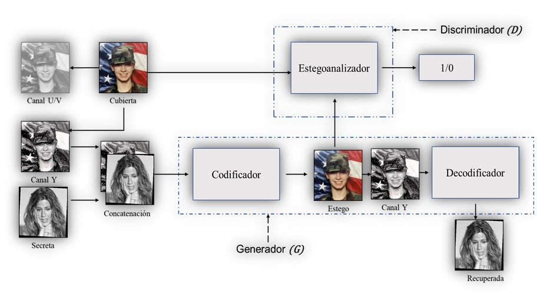
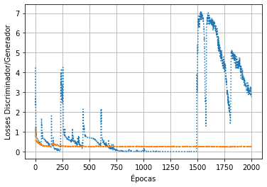
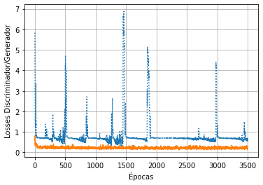
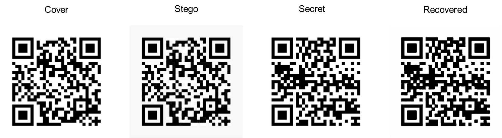

<!-- HEADINGS -->
# Application of the ISGAN Model for digital images with coding

## Introduction
The theme of this work is the application of **Steganography in digital images**, to implement an extra security layer in them and verify their authorship.

The implementation of the *ISGAN* model is carried out to perform steganography in **encoded images**. Model from ISGAN paper: https://arxiv.org/abs/1807.08571

Steganography is applied on a digital image (cover) to embed another secret image (secret information). Encode images are those that represent encrypted information; for example, QR Codes and Fingerprints.

For the implementation of ISGAN, the coding made by Morgan Lefranc was taken as a basis, which can be found at: https://github.com/Neykah/isgan

From the Lefrac code, the following adjustments were modified:

1. The code now runs with Tensorflow 2.6 or higher.
2. Changed the network format to the first channel
3. Tensorflow Spatial Pyramid Pooling is now used
4. The Mixed loss function used was implemented through the Tensorflow libraries  for the M-SSIM and SSIM indices, for the MSE index only the programming based on Tensorflow functions was carried out.
5. The equations for the transformation of the YCbCr space were modified
6. The output is normalized to 8 bits and the results are observed in RGB

The following Figure shows the ISGAN model graphically. The ISGAN model consists of a Generator (G) (Encoder-Decoder Network) and a Discriminator (D) (Steganalizer Network)

## Data Base
The database for the application of the ISGAN model in QR codes was obtained from https://www.kaggle.com/datasets/coledie/qr-codes. In which is the code to generate QR codes with numbers from 1000 to 10000. This code was modified to obtain a training set of 10,000 images and a test set of 2000 images with numbers from 1 to 10000

The database for the application of the ISGAN Model for fingerprints was obtained from: https://www.kaggle.com/code/kairess/fingerprint-recognition/data. For the training set, 4000 images of the real set were used and 6000 images of the easy alteration set.

All images must have a dimension of 256x256 pixels and must be in RGB format.

## Dependencies

* Tensorflow 2.6
* Keras 2.6
* tensorflow_addons
* Matplotlib 3.5.1
* Numpy 1.22.3
* imageio 2.14.1

## Hardware
* CPU: Intel i7-10750H a 2.6 GHz
* GPU: NVIDIA GForce RTX 2070 Max-Q Desing.
* RAM: DDR4 32 GB a 2933MHz

Note: **if they use colab, just run premium version.**

## ISGAN Model Training
The training of the ISGAN network for the application of QR codes has been carried out for 1500 epoch. The following Figure shows the graph with the training indices, G indicates the loss indices for the Generator and D the loss indices for the Discriminator.

The training of the ISGAN network for the application of fingerprints was carried out for 3000 epoch. The following Figure shows the graph with the training indices, G indicates the loss indices for the Generator and D the loss indices for the Discriminator.

## Results

The results of the implementation of the ISGAN Model in QR codes are presented below. The following Figure shows the covered, stego, secret and recovered image.

